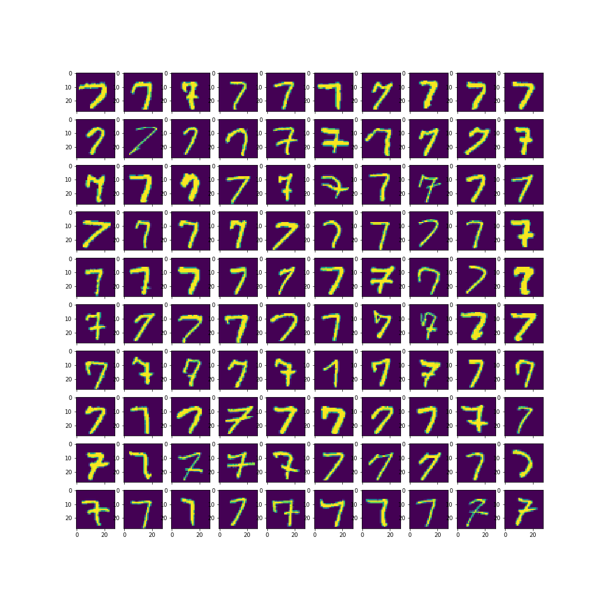

# Deep learning

In this repository, we will be clustering MNIST digits dataset using KMeans algorithm. I did not take trouble to cluster using DBScan or Agglomerative algorithms but as it would require lot of analysis in setting parameters( epsilon and min_samples in DBScan and height in agglomerative) but i do have a place holder for anyone to try and let me know.

We were able to achieve 98.5% clustering accuracy with KMeans from the features extracted from CNN model.
  
