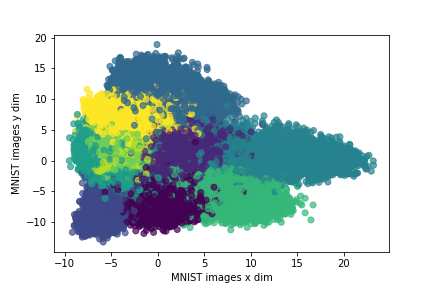

# Clusterin MNIST digits

In this repository, we will be clustering MNIST digits dataset using KMeans algorithm. I did not take trouble to cluster using DBScan or Agglomerative algorithms, as it would require lot of analysis in setting parameters( epsilon and min_samples in DBScan and height in agglomerative) but i do have a place holder for anyone to try it out.

I am able to achieve ~98.5% clustering accuracy with KMeans from the features extracted from CNN model. Following are the steps followed 

1. Trained CNN model(8 layers) using model mentioned in [Keras](https://keras.io/examples/mnist_cnn/) page with 99.2% accuracy
2. Extracted features(neuron values for each image) from 7th layer which best desribe digit images.
3. Clustered using KMeans algorithm from 128 dimension feature vector extracted from CNN model

For step 1 & 2, execute 
```python
python Clustering/MNIST/SimpleNet/feature_extraction.py
```
and
For step 3, execute 
```python
python Clustering/MNIST/SimpleNet/MNISTClustering.py
```
Feature vector representing each image is of 128 dimension, and in order to visualize the image cluster i used PCA(Principal component analysis) to reduce the dimentionality to 2 for plotting purpose

## MNIST digit clusters:



Evaluated clustering results by comparing original label of digit images and clustered image label and calculated accuracy which turns out to be ~98.5%.

Considered label of cluster by finding the highest occuring digit image and rest other images to be miss clustered.

Following are the representation of 2 clusters by taking random 100 images from each of those clusters.

## Cluster havingg images of dgit 7:
  

## Cluster having images of digit 6:


You can also check all 10 cluster dumps @ **Clustering-MNIST/Clustering/MNIST/SimpleNet/output/kmeans/**
